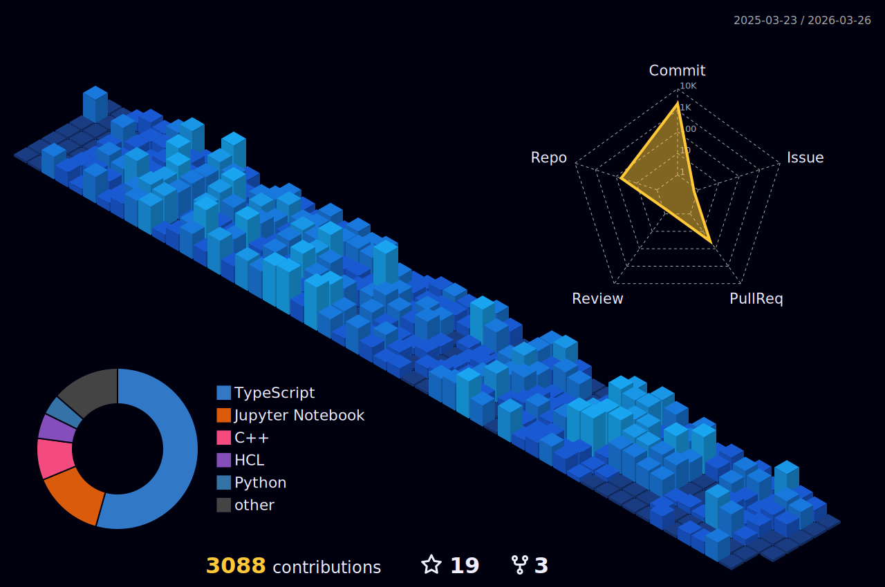

## 👨‍💻 About Me

**Hello, I'm Robiul Hossain — a Software Engineer dedicated to building scalable, secure, and high-performance systems.**

I have expertise in  **Python**, **TypeScript**, **FastAPI**, **Node.js**, **Express.js**, and **NestJS**, as well as extensive experience with databases such as **PostgreSQL**, **MongoDB**, and **Redis**.

My professional focus spans backend development and DevOps. I am proficient with tools and technologies including **Docker**, **Nginx**, **Git**, **GitHub**, **GitHub Actions**, and monitoring solutions like **Prometheus** and **Grafana**. I am committed to implementing clean architecture, optimizing database design, automating workflows, and ensuring system resilience.

I am currently seeking **full-time opportunities** in Software Engineering roles.

## 🛠 What I'm Working On

- Specializing in backend development with Node.js, Python, TypeScript, FastAPI, Express.js & NestJs.
- Designing scalable, high-performance databases using PostgreSQL, MongoDB and Redis.
- Strengthening problem-solving with regular DSA practice and low-level design work.
- Applying DevOps practices: CI/CD with Docker, GitHub Actions, Nginx, aws labs etc.
- Managing large codebases efficiently with Monorepo strategies.
- Boosting productivity through a custom-tailored Neovim workflow.
- Deepening knowledge in system design, distributed systems, and microservice architecture.

## 📈 Vision

Over the next 4–5 years, I aim to grow into a **Principal Software Engineer**, specializing in system design, backend infrastructure, DevOps, and platform reliability, while improving leadership and communication skills to drive impactful projects.

## 👨‍💻 My Skills

### 🗣️ Languages

### 🌐 Frontend

### ⚙️ Backend

### 🗄️ Databases

### 🧪 Testing & Quality Assurance

## 🔧 My Tools

### 🖥️ OS & Terminals

### 🌳 Version Control & CI/CD

### 🛠️ Development Tools

### 🚀 Deployment & DevOps Tools

### ☁️ Server & Cloud

### 🔍 Monitoring & Observability

### 📚 Documentation & API Testing

### 📦 Package & Process Management

### 💬 Team Communication

## 🏃 My Profiles

## 👥 Connect With Me

    

        
        
        
        
    

## 📊 My Stats 

        
        

  

    

        
    

