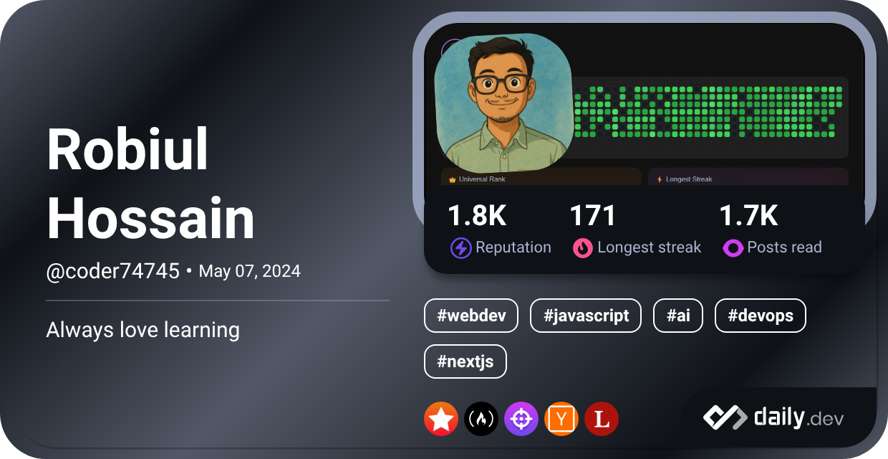

  

## 📖 About Me

👋 Hello! I'm Robiul Hossain, a Software Engineer specializing in web technologies, particularly JavaScript, TypeScript, and Python.

🏗️ I focus on backend development, utilizing Node.js, Express.js, MongoDB, and PostgreSQL to create robust applications.

🌱 I am committed to continuous learning; recently, I've been delving into system design to develop more scalable and efficient solutions.

🛠️ As a strong advocate for DevOps, I enjoy automating processes to enhance productivity and streamline workflows.

🧪 I prioritize code quality and reliability, employing testing frameworks like Vitest, Cypress, and Jest to ensure smooth operation.

🔐 My recent interest in cybersecurity has led me to explore real-world challenges and issues, which I find incredibly engaging.

🚀 At OctopusX, I oversee deployments and application maintenance using Docker, Nginx, and GitHub Actions, always seeking opportunities for workflow improvement.

## 👨‍💻 My Skills

### 🗣️ Languages

### 🌐 Frontend

### ⚙️ Backend

### 🗄️ Databases

### 🧪 Testing Frameworks

## 🔧 My Tools

### 🖥️ Operating Systems & Shells

### 🌳 Version Control & CI/CD

### 🌐 Web Development Tools

### 📦 API Testing & Documentation

### 📦 Package Managers & Process Management

### 💬 Communication

## 🏃 My Profiles

## ✅ My Stats 

    

        
    

    

        
    

    

        
    

    

        
    

## 👥 Connect With Me

    

        
        
        
        
    

[Summary](https://focusmvp.retool.com/embedded/public/a4a644a9-a109-411f-a5dd-32035c1d4afb/profile)
