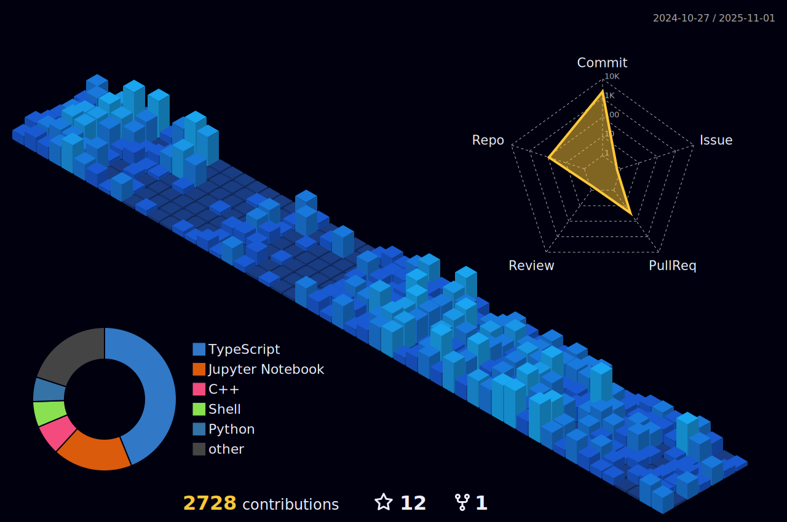

# About Me

**I'm Robiul Hossain — Software Engineer focused on scalable, secure, and high-performance systems.**

Experienced in backend and full stack development with TypeScript, Python, Go, Node.js (Express, NestJS, FastAPI), React, Next.js, PostgreSQL, MongoDB, Redis, and ElasticSearch. Skilled in DevOps using AWS, Docker, Kubernetes, Nginx, GitHub Actions, Terraform, Terragrunt, Prometheus, Grafana.

## Current Focus

- Backend & API development (Node.js, Python, Go, TypeScript, FastAPI)
- Next.js & React frontend
- Cloud/infrastructure (AWS, Docker, Terraform, Terragrunt, Kubernetes)
- Distributed systems, system design, data pipelines (RabbitMQ)
- Automation, monorepo management, CI/CD
- Testing (Jest, Pytest, Playwright, Cypress)
- Learning cybersecurity on TryHackMe

## Goal

Grow into a **Distinguished Software Engineer** specializing in architecture, platform reliability, DevOps, and technical leadership.

## Skills & Tools

- **Languages**: Go,TypeScript, Python, JavaScript, C++, Shell, SQL, YAML
- **Backend**: Node.js, Express, NestJS, FastAPI, RabbitMQ
- **Frontend**: React, Next.js, Remix
- **Databases**: PostgreSQL, MongoDB, Redis, ElasticSearch
- **DevOps & Cloud**: Docker, AWS, Terraform, Terragrunt, Kubernetes, Nginx, GitHub Actions, Ansible
- **Testing**: Playwright, Jest, Cypress, Pytest, Vitest, Selenium
- **Monitoring**: Prometheus, Grafana, Cronitor, Uptime Robot
- **Docs & APIs**: Swagger, Postman, Notion, Obsidian, Confluence
- **Collaboration & Productivity**: Jira, Slack, Microsoft Teams

## Profiles

## Connect

## Stats 

